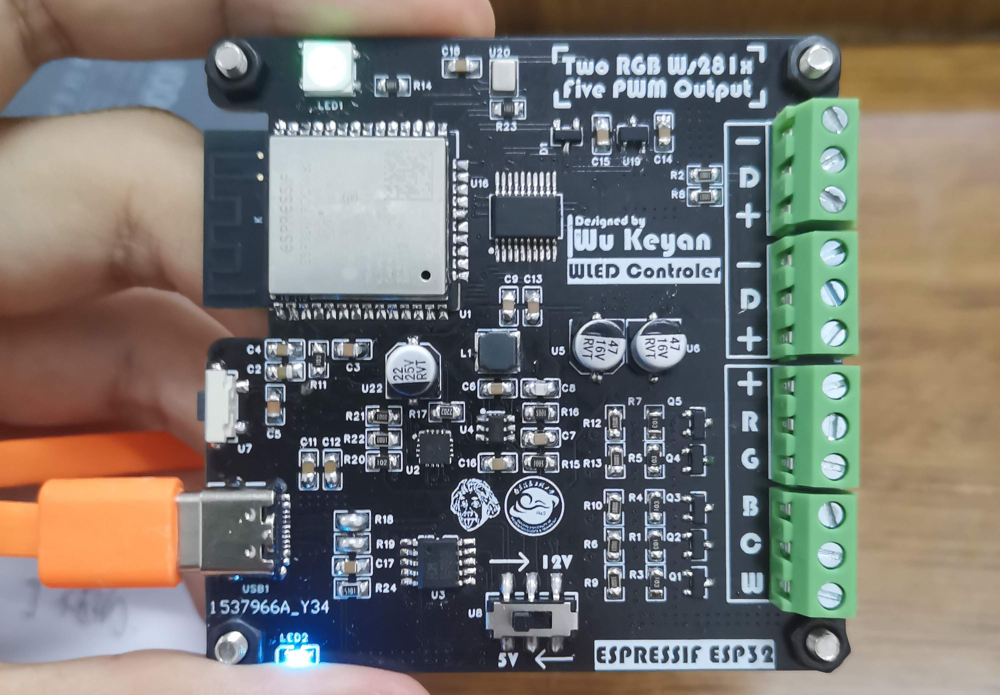
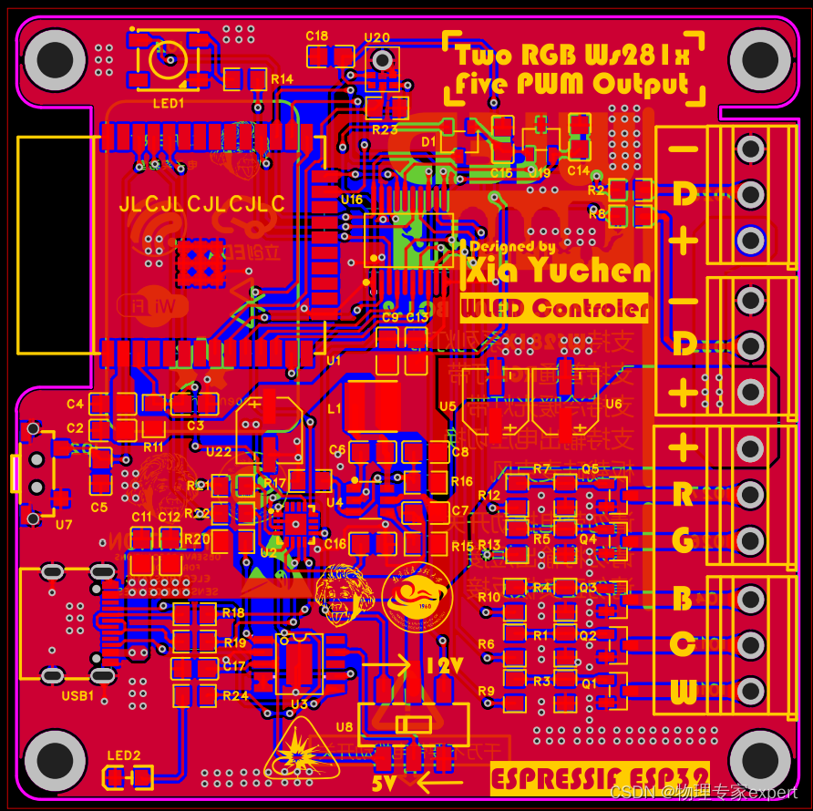

# 项目介绍
WLED是一个开源项目，首先放上[开源地址](https://github.com/Aircoookie/WLED/releases)，基于此开源项目的控制器原理图来自up主：[HACK实验室](https://space.bilibili.com/395145107?spm_id_from=333.337.0.0)，感谢大佬开源的项目文件，我在其原理图的基础上，将其绘制在嘉立创EDA专业版上（原PCB为KICAD绘制），该控制器主控采用ESP32模组，具有两路WS281X系列灯带控制，五路PWM控制，两种输出电压切换等功能，兼容市面上几乎所有的灯带产品。

---
## 视频地址：[B站链接](https://www.bilibili.com/video/BV1LN411A7Aa/?spm_id_from=333.999.0.0&vd_source=4e3f44990520382b49c509f140bd3ce4)
## 电路设计分析：[CSDN链接](https://blog.csdn.net/physicsexpert/article/details/129629626?spm=1001.2014.3001.5502)
## 关于硬件
硬件相关的开源资料在hardware文件夹，本项目的pcb采用嘉立创EDA专业版设计，请使用嘉立创EDA专业版打开工程文件，Gerber文件为pcb加工文件，可直接发送至工厂打样

## 关于软件
